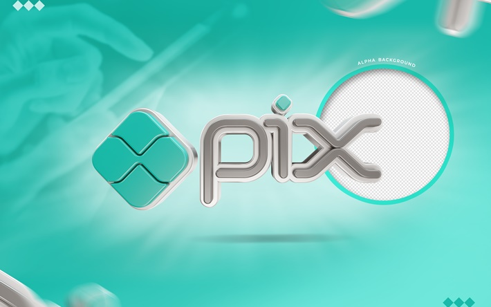

<h1 align="center"> Pix-Project </h1> 
 Project developed to simulate a simple Pix payment system using Python. 
 
 <a href="#-tecnologias">Technologies</a>&nbsp;&nbsp;&nbsp;|&nbsp;&nbsp;&nbsp; <a href="#-applications">Applications</a>&nbsp;&nbsp;&nbsp;|&nbsp;&nbsp;&nbsp; <a href="#-projeto">Project</a>&nbsp;&nbsp;&nbsp;|&nbsp;&nbsp;&nbsp; <a href="#layout">Layout</a>&nbsp;&nbsp;&nbsp;|&nbsp;&nbsp;&nbsp; <a href="#memo-licença">License</a> 
 
  
  

🚀 Technologies

This project was developed with the following technologies:

- Python

🔧 Applications

- Object-Oriented Programming

- Classes and Objects

- Methods

- Encapsulation

- Simple Transaction Simulation

💻 Project

Pix-Project simulates a simple Pix payment system where a user can create accounts, make transfers, and view transaction history. It is an educational project aimed at practicing OOP concepts in Python.

🔖 Layout

You can view the project files and structure directly in the GitHub repository
.

:memo: License

This project is under the MIT license.